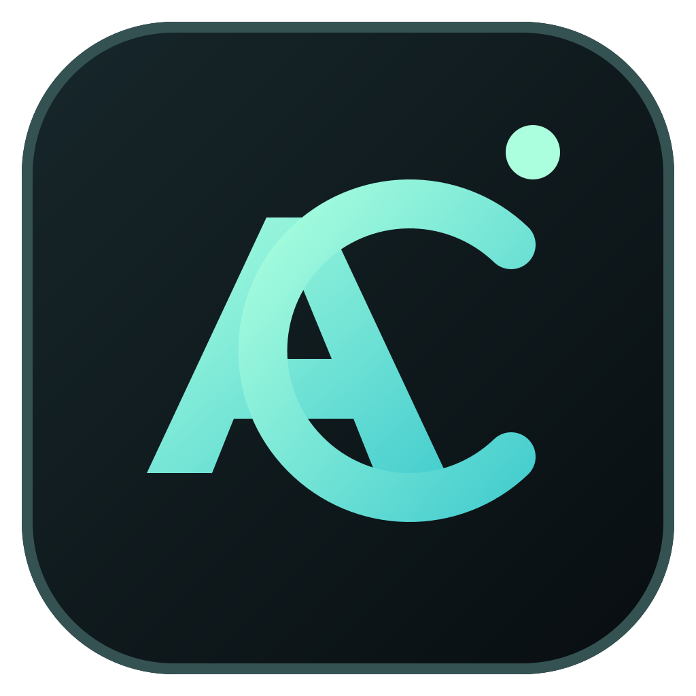

<p align="center"></p>

<h1 align="center">Agent Club</h1>

<p align="center">Your agents. Your workspace. Your command center.</p>

Agent Club brings AI conversations, assistants, tools, scheduled tasks, and the Jarvis HUD into one desktop workspace.

- **Jarvis in the left navigation:** the supplied HUD runs inside the app, with its own local vault, live status, reports, and optional voice controls.
- **Agent Club identity:** desktop and browser names, app icons, installers, notifications, and support links.
- **Independent updates:** releases are fetched only from this repository.
- **Local data:** a separate application identity and vault keep Agent Club distinct from other apps.

## Development

Requires Node.js 22–24 and Bun. The bundled agent backend uses AionCore; see [development setup](docs/contributing/development.md) for its build/download prerequisites.

```bash
bun install
bun start
```

The first launch builds Jarvis. Open **Jarvis** from the left sidebar; the desktop app starts its local service automatically. Voice recognition, speech synthesis, and queued Claude work need the optional services described in [Agent Club setup](docs/agent-club.md). The HUD ships with clearly labeled starter data.

```bash
bun run package       # Compile desktop + Jarvis
bun run dist:mac      # Package for macOS
bun run dist:win      # Package for Windows
bun run dist:linux    # Package for Linux
```

## Checks

```bash
bun run lint
bun run format:check
bunx tsc --noEmit
bun run i18n:types
node scripts/check-i18n.js
bun run test
bun run jarvis:test
```

## Source and notices

Agent Club is an independently maintained fork of [AionUi](https://github.com/iOfficeAI/AionUi), licensed under [Apache-2.0](LICENSE). Original copyright notices remain in the source. The Jarvis integration comes from the user-supplied `jarvis-hud-1.0.1.zip`; its provenance and modifications are documented in [the integration guide](docs/agent-club.md).

[Releases](https://github.com/Samin12/agent-club-desktop/releases) · [Issues](https://github.com/Samin12/agent-club-desktop/issues)
